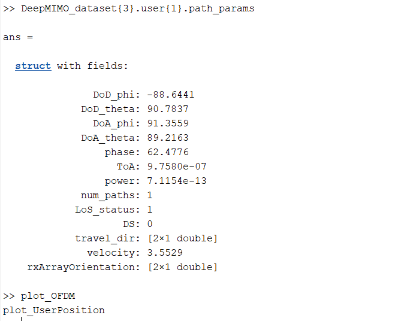

# Adapting DeepMIMO Framework for Ray‑Tracing Based Beam Prediction in 5G Networks

The DeepMIMO 5G Beam Prediction project implements a parameterized dataset generation framework for millimeter‑wave and massive MIMO channel modeling. Leveraging accurate ray‑tracing data from Remcom Wireless InSite, it produces realistic channel matrices and user‑location information for deep learning–based beam prediction research.

## Features
- **Ray‑Tracing Scenario:** Uses the ‘O1’ outdoor ray‑tracing scenario with detailed environmental geometry and material properties.
- **Parameterizable Dataset:** Customize BS antenna arrays, antenna spacing, system bandwidth, OFDM subcarriers, and number of channel paths.
- **Efficient Channel Generation:** MATLAB scripts automate channel matrix computation across subcarriers and strongest paths.
- **Structured Output:** Stores data in a `.mat` file with easy indexing: `DeepMIMO_dataset{b}.user{u}.channel` and `.loc`.

## Installation

### Prerequisites
- MATLAB R2019a or later
- Remcom Wireless InSite ray‑tracing data
- DeepMIMO framework files

### Steps
```bash
git clone <repository-url>
cd DeepMIMO-5G-Beam-Prediction
# Place Remcom scenario files in ./ray_tracing/O1
# Place DeepMIMO toolkit in ./DeepMIMO
```

## Usage
1. Open MATLAB and add project paths:
   ```matlab
   addpath(genpath(pwd));
   ```
2. Configure parameters in `config.m`:
   ```matlab
   config.activeBS = [3,4,5,6];
   config.userRows = 1000:1500;
   config.antConfig = [1,32,8];
   config.subcarriers = 1024;
   config.numPaths = 5;
   ```
3. Run the dataset generation script:
   ```matlab
   generateDeepMIMODataset(config);
   ```
4. The output `DeepMIMO_dataset.mat` will appear in the project root.

## Future Work
- Integrate the generated dataset into Python‑based ML pipelines for beam prediction.
- Develop and benchmark deep learning models (e.g., CNNs, Transformers) for beam selection.
- Extend support to multi‑frequency and mobile user scenarios.
- Explore 6G channel modeling and dataset augmentation.

## Results

### 1. Dataset Generation Output

*Figure 1: MATLAB console output showing the DeepMIMO dataset construction progress and the final dataset dimensions.*

### 2. Path Parameters Structure

*Figure 2: `DeepMIMO_dataset{3}.user{1}.path_params` struct detailing angles, delays, power, and other ray-tracing path parameters.*

### 3. OFDM Response & UE Position Plots

*Figure 3: (Left) OFDM channel magnitude response (surface and heatmap). (Right) Base station (blue circle) and user (red cross) positions with user velocity vectors.*

## Contributors
- Ritika
- Aninda Paul
- Ayush Kumar
- Ved Prakash Meena

## Acknowledgments
We thank the original DeepMIMO authors for their open dataset framework and Remcom for Wireless InSite. We also acknowledge the guidance of Dr. Bhupender Kumar in the EC431 course at IIIT Vadodara.

